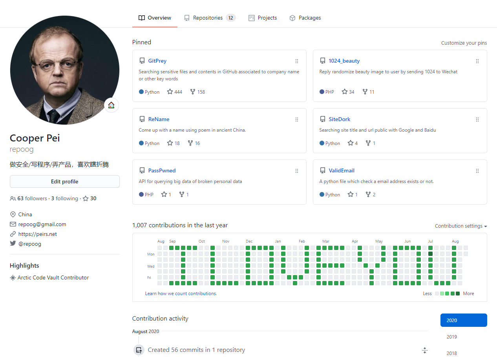

# 爱你3000遍
爱你3000遍是一个shell程序，用来纪念《复仇者联盟4》中钢铁侠的台词"Love you 3000"。

## 设计思路
程序会根据已经排列好的标识文件，在特定的日期push代码至Github，最终在个人Github提交榜中显示I LOVE YOU的字样。

在特定日期会会连续进行8次commit和push，每次commit内容是Love Love Love，共需要125个特定日期，commit log总计3000个Love。

## 文件说明
ascii.txt：根据Github提交榜大小编排好的ASCII字符，1代表提交代码，0代表什么都不做；

commit.txt：每次push需要程序有内容更新，该文件用于更新程序自身；

days.txt：初始是0，用于记录程序正式执行的次数，结合ascii.txt判断当天是否提交代码；

is_start.txt：初始是0，用于计算程序自动提交是否开始，根据提交榜大小，需要从周日开始计算；

loveyou.sh：主程序

## 其他
有兴趣的朋友可以改一改程序，用于男（女）朋友表白什么的，甚至于结合OCR作为效率最差的CC服务指令。

## 效果

# loveyou3000
Love you thre thousand times, is a little program for memorial of Iron man in <The Avengers 4:Endgame>.

## Design
Program will commit in ascii mode to show "I LOVE YOU" in Github contribution area.

Eash git push in right day will commit 8 times with "Love Love Love", and there are 125 git push in all, so there will be 3000 Love at last.

## Files
ascii.txt: a file for list ascii.

commit.txt: a file for commit for each time git push.

days.txt: a file for record program execution days.

is_start.txt: a file for record if program should be executed.

loveyou.sh: main program.

## Others
You can change this program for any other porpuse, like show you love for girlfriend or boyfriend.
